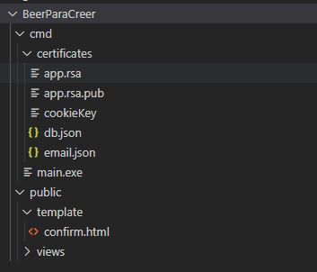

# Restaurante-Gorm-Echo

## Requisitos

Para el correcto funcionamiento del programa se debera contar con un sistema operativo Windows 7 o superior y tener el motor de base de datos MySql o PostgreSql

## Estructura de archivos

Para usar el programa se debera crear una carpeta llamada cmd y otra llamada public, ambas deben estar en el mismo directorio. El programa usa rutas relativas, por lo que se puede seleccionar cualquier directorio.

A continuacion se muestra un ejemplo de la estructura de archivos.



### Carpeta cmd

Dentro de la carpeta cmd se encontrara el ejecutable o archivo main.go, ademas de otra carpeta llamada certificates

#### Carpeta certificates

Aqui se almacenaran todos las credenciales necesarias para el correcto funcionamiento del programa, los archivos necesarios son:

- app.rsa

- app.rsa.pub

- cookieKey

- db.json

- email.json

### Carpeta public

Contendra la carpeta views/assets/img/product,  en dicha carpeta se almacenaran las imagenes de los productos.

## Credenciales

En total se debe de contar con 5 archivos, los cuales se mostraran a continuacion, las claves rsa pueden ser generadas en <https://travistidwell.com/jsencrypt/demo/>

### app.rsa

Este archivo contendra la clave rsa privada

### app.rsa.pub

Este archivo contendra la clave rsa publica

### cookieKey

Este archivo contendra una clave con una longitud de 32 caracteres

### db.json

Este archivo debe tener la siguiente estructura:

```json
{
  "type_db":"",
  "user":"",
  "password":"",
  "port":"",
  "name_db":""
}
```

- **type_db:** especifica el tipo de base de datos, puede ser *POSTGRES* o *MYSQL*, seleccionar POSTGRES realizara una conexion con la base de datos en PostgreSql, en cambio si se selecciona MYSQL se realizara la conexion con MySql.

- **user:** selecciona el usuario con el cual se accedera a la base de datos.

- **password:** selecciona la contraseña del usuario.

- **port:** selecciona el puerto con el cual establecera la conexion a la base de datos.

- **name_db:** selecciona el nombre de la base de datos a la cual se conectara.

### email.json

Este archivo debe tener la siguiente estructura:

```json
{
  "email":"",
  "password":""
}
```

- **email:** selecciona el email del cual seran enviados los codigos de verificacion.

- **password:** selecciona la contraseña del email.

## Migraciones

```go
    storage.DB().AutoMigrate(
		&model.Product{},
		&model.Address{},
		&model.Permission{},
		&model.Establishment{},
		&model.Rol{},
		&model.User{},
		&model.Table{},
		&model.Pay{},
		&model.Order{},
		&model.OrderProduct{},
	)
```

## Contraseñas

Las contraseñas de usuarios deben de contener al menos una mayuscula, una minuscula y un caracter especial, ademas de tener una longitud mayor o igual a 8

## Permisos

Cada permiso esta identificado por un id y posee una descripcion sobre su funcionamiento

1. Sin restricciones

2. CRUD estaclimientos

3. Asignar roles de menor jerarquia

4. CRUD productos

5. Tomar orden en un establecimiento

6. Confirmar Pago

7. Ver todas las ordenes sin completar del local

8. CRUD metodos de pago

9. Ver facturas

10. Asignar empleado a un establecimiento

11. Mostrar todos los empleados del establecimiento

12. Mostrar todos los empleados

13. CRUD Roles

14. CRUD Tables

15. Mostrar ordenes pendientes del empleado

16. Asignar rol de menor jerarquia de empleado dentro de un establecimiento

## Roles

Los roles son un conjunto de permisos que puede tener un usuario.

- **owner**
  - 1
- **admin**
  - 2
  - 3
  - 4
  - 8
  - 11
  - 12
  - 13
- **manager**
  - 9
  - 10
  - 11
  - 16
- **waiter**
  - 5
  - 6
  - 15
- **chef**
  - 7
